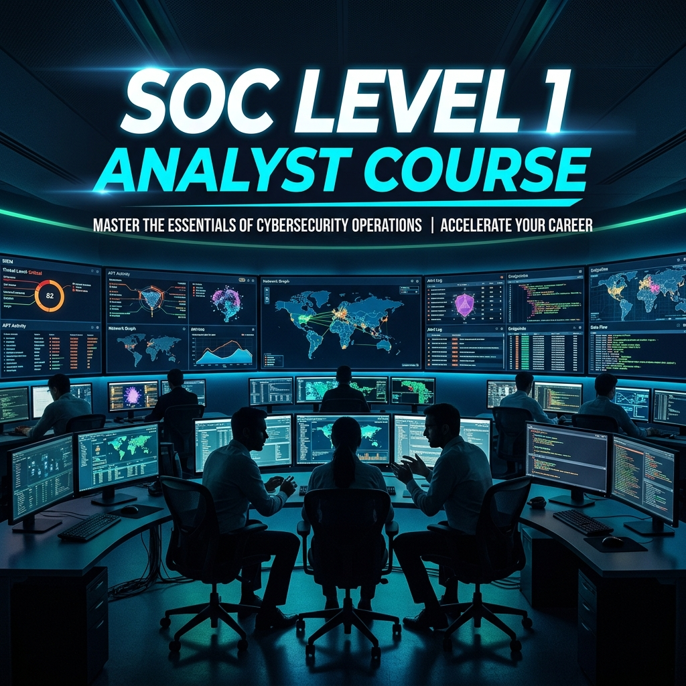
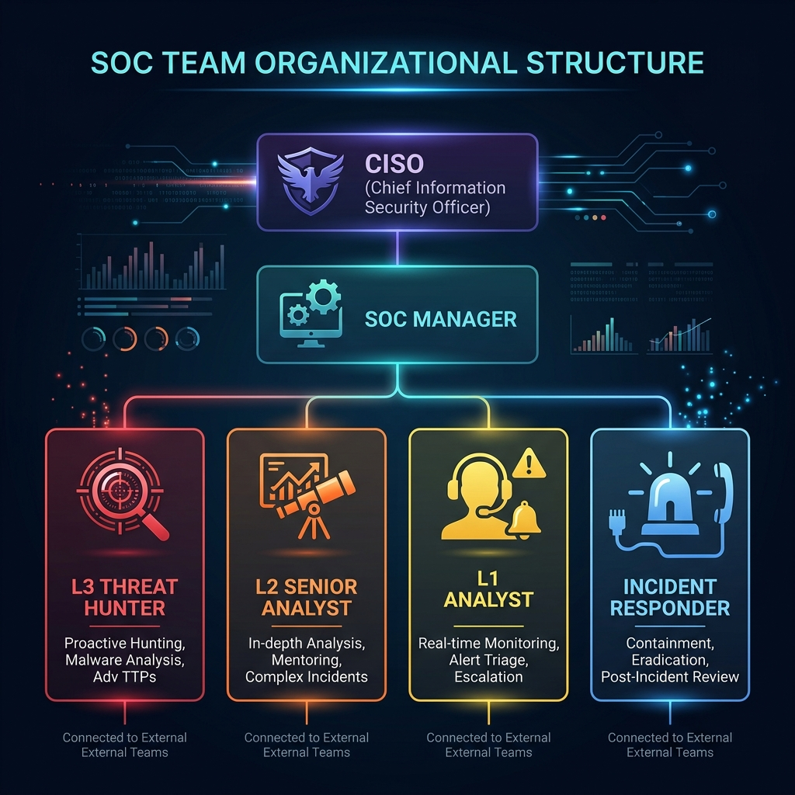
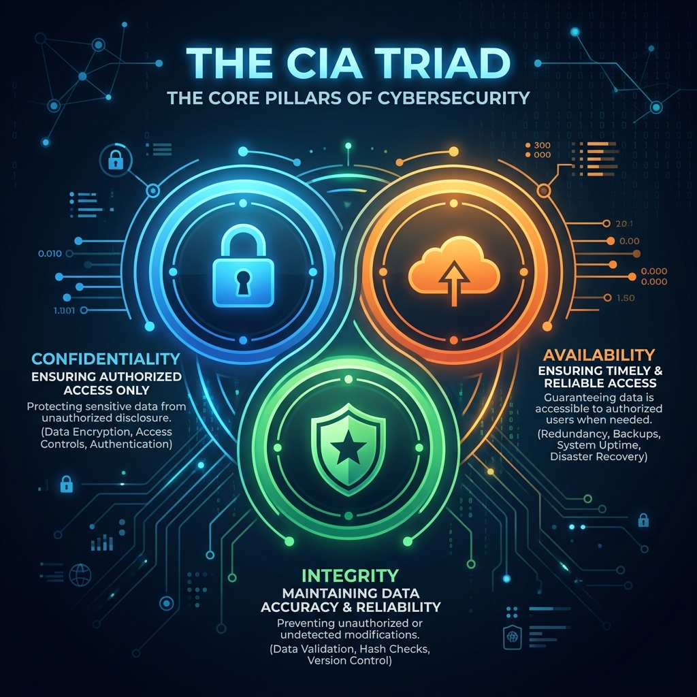
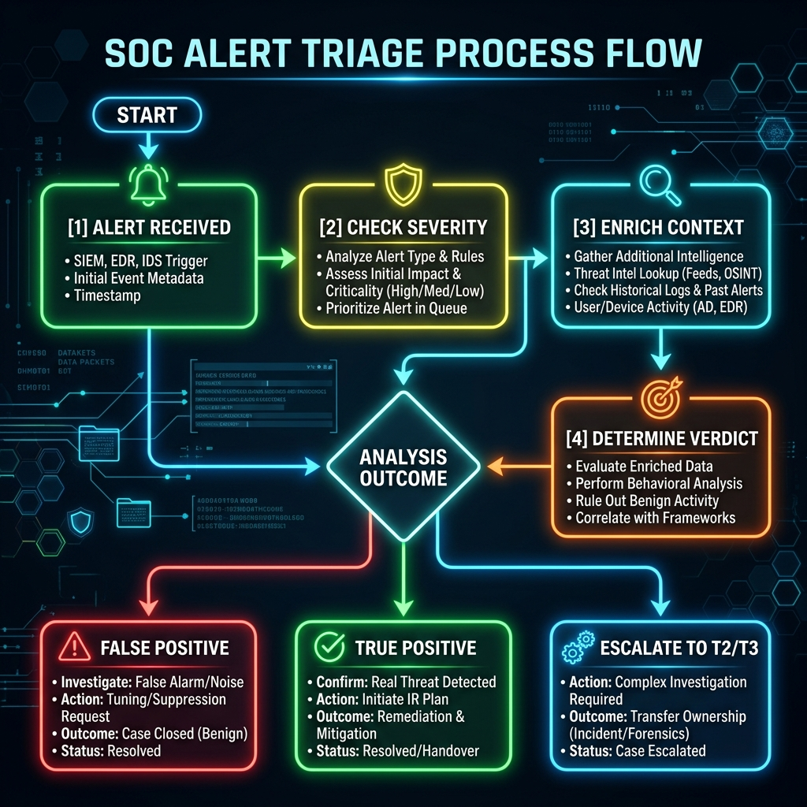
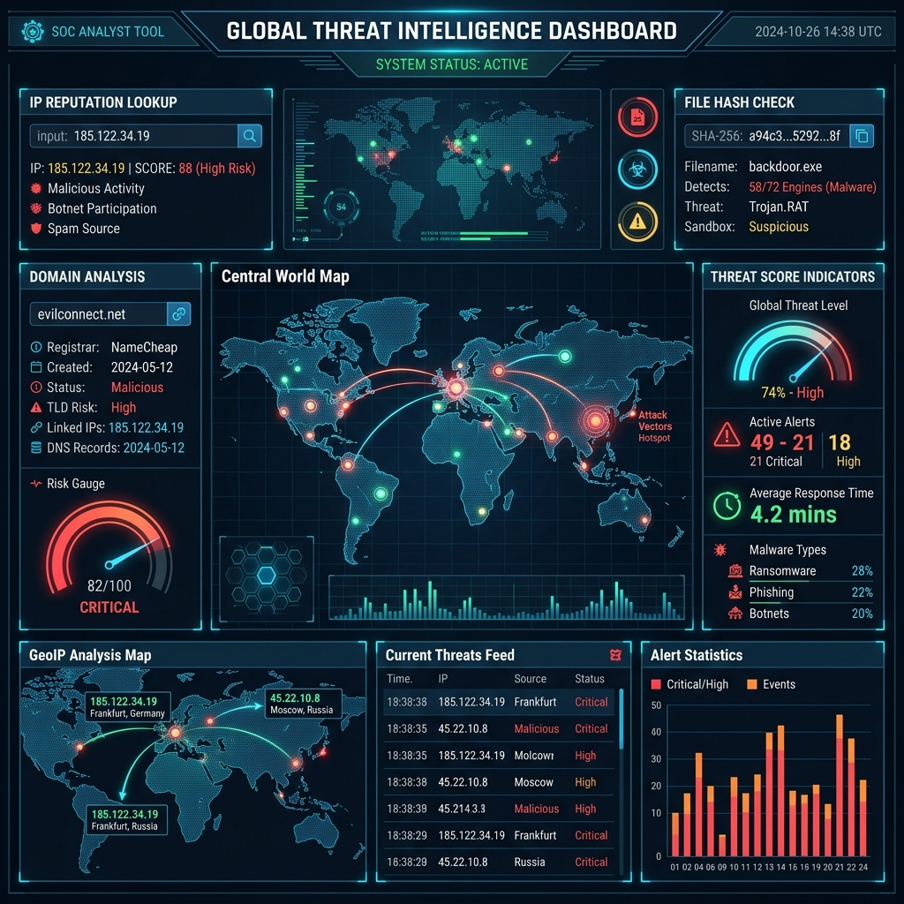
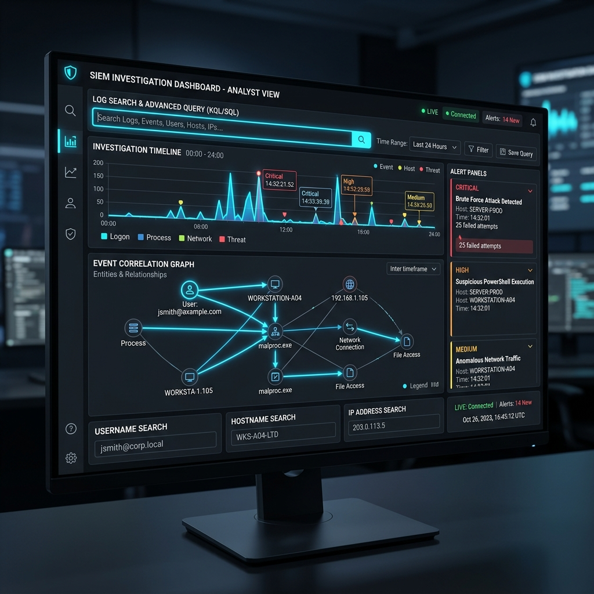
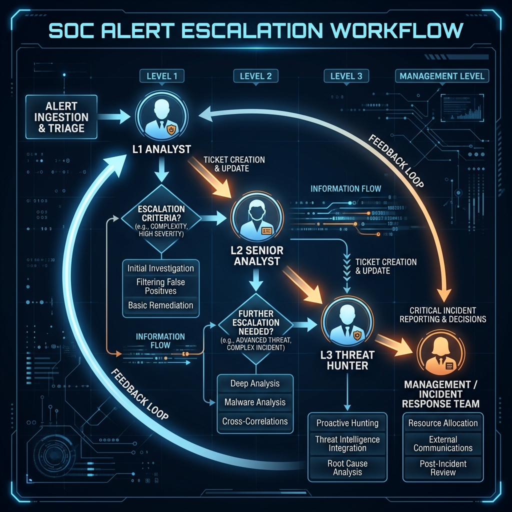

# SOC Level 1 Analyst Course

> Complete beginner-to-advanced training for SOC Level 1 analysts.

**Language:** Bangla-English mixed | **Level:** Beginner → Advanced | **Duration:** 40+ hours

---

## 📋 Quick Start

1. **Start here:** [Module 1: Introduction to SOC](modules/module-01-introduction-to-soc/index.md)
2. **Progress:** Complete modules 1-28 sequentially
3. **Labs:** Practice with labs in modules 24-26
4. **Assessment:** Final exam in module 28

---

## 📚 Course Structure

### Phase 1: Foundations (Modules 1-7)
- Module 01: Introduction to SOC
- Module 02: SOC Team Structure
- Module 03: SOC Tools & Environment
- Module 04: Events, Logs & Alerts
- Module 05: Alert Properties
- Module 06: Alert Prioritisation
- Module 07: Alert Triage Fundamentals

### Phase 2: Investigation Skills (Modules 8-16)
- Module 08: Alert Verdicts
- Module 09: Investigation Methodology
- Module 10: Identity Inventory
- Module 11: Asset Inventory
- Module 12: Threat Intelligence Lookups
- Module 13: Network Diagrams
- Module 14: Workbooks, Playbooks, Runbooks
- Module 15: Enrichment Process
- Module 16: SIEM Investigation

### Phase 3: Professional Skills (Modules 17-23)
- Module 17: Common Alert Scenarios
- Module 18: Alert Reporting
- Module 19: Alert Escalation
- Module 20: SOC Communication
- Module 21: SOC Metrics & Objectives
- Module 22: SOC Improvement & Learning
- Module 23: Professional Skills & Resilience

### Phase 4: Practical Application (Modules 24-28)
- Module 24: Beginner Practical Lab
- Module 25: Intermediate Practical Lab
- Module 26: Advanced Practical Lab
- Module 27: Capstone Project
- Module 28: Final Assessment

---

## 🏢 SOC Team Structure

> Understanding the hierarchy of a Security Operations Center.

---

## 📊 Course Statistics

| Metric | Value |
|--------|-------|
| **Total Modules** | 28 |
| **Total Content Lines** | ~23,500 |
| **Playbooks** | 6 |
| **Diagrams** | 6 |
| **Theoretical Modules** | 23 |
| **Practical Labs** | 4 |
| **Capstone Modules** | 1 |
| **Assessment Questions** | 30 |
| **Estimated Learning Time** | 40+ hours |
| **Language** | Bangla-English mixed |

---

## 🔐 Core Concept: The CIA Triad

> The foundation of every security decision you will make as an L1 Analyst.

---

## 🎯 Learning Outcomes

After completing this course, you will be able to:

✅ Understand SOC operations and team structure  
✅ Triage alerts systematically (5-step process)  
✅ Investigate alerts using enrichment techniques  
✅ Determine alert verdicts (TP/FP/Benign/Suspicious)  
✅ Escalate appropriately to L2/L3 teams  
✅ Write professional alert reports  
✅ Communicate clearly with stakeholders  
✅ Understand SOC metrics and performance targets  
✅ Handle real-world incident scenarios  
✅ Apply continuous improvement mindset  

---

## 🔄 Alert Triage Process

> The 5-step systematic process every L1 analyst follows when handling an alert.

---

## 🚀 Getting Started

### Prerequisites
- Basic computer security knowledge
- Familiarity with Windows/Linux
- Understanding of networking basics
- Motivation to learn cybersecurity

### How to Use This Course

1. **Read Module 1** to understand SOC fundamentals
2. **Follow sequentially** through Modules 2-23
3. **Complete practical labs** in Modules 24-26
4. **Do capstone** in Module 27 (full shift simulation)
5. **Take final exam** in Module 28

### Time Commitment

- **Per module:** 1-2 hours
- **Practical labs:** 2-3 hours each
- **Capstone:** 2-3 hours
- **Total:** 40+ hours

---

## 🌐 Threat Intelligence

> Leveraging global threat feeds and intelligence sources during investigations.

---

## 📖 How to Navigate

### For Learners
1. Start: `modules/module-01-introduction-to-soc/index.md`
2. Reference: `docs/learning-objectives.md` for guidance
3. Practice: `modules/module-24-beginner-practical-lab/index.md`
4. Review: `playbooks/` for real procedures

### For Instructors
1. Overview: `docs/course-overview.md`
2. Roadmap: `docs/course-roadmap.md`
3. Materials: All in `modules/` folder
4. Assessment: Module 28 final exam

### For Reference
- **Glossary:** `docs/glossary.md`
- **Career Path:** `docs/soc-l1-career-path.md`
- **Diagrams:** `diagrams/` folder
- **Playbooks:** `playbooks/` folder

---

## 🖥️ SIEM Investigation

> How analysts use Security Information and Event Management tools to investigate alerts.

---

## 📝 File Summary

| Directory | Purpose | Status |
|-----------|---------|--------|
| modules/ | Core course content (28 modules) | ✅ Complete |
| playbooks/ | SOC alert response procedures | ✅ Complete |
| diagrams/ | Visual guides & architecture | ✅ Complete |
| docs/ | Documentation & guidance | ✅ Complete |
| datasets/ | Sample data for labs | 📋 Ready |
| templates/ | Document templates | 📋 Ready |
| solutions/ | Answer keys | 📋 Ready |
| references/ | Quick reference guides | 📋 Ready |
| assets/ | Images & media | 📋 Ready |
| scripts/ | Utility scripts | 📋 Ready |

---

## 📤 Alert Escalation Workflow

> When and how to escalate alerts from L1 to L2/L3 teams.

---

## 🔄 Updates & Contributions

See `CONTRIBUTING.md` for guidelines on:
- Reporting issues
- Submitting improvements
- Adding new content
- Fixing errors

See `CHANGELOG.md` for release history.

---

## 📄 License

This course is provided as educational material. See `LICENSE` for details.

---

## 🎓 Certificate

Upon completing all 28 modules and passing the final assessment (70%+), you will receive a course completion certificate.

---

## 💡 Tips for Success

1. **Take notes** while reading each module
2. **Review mini-quizzes** to reinforce learning
3. **Complete practical labs** - hands-on practice is essential
4. **Study playbooks** - reference real procedures
5. **Review diagrams** - visual understanding helps
6. **Join study groups** - collaborative learning
7. **Practice repeatedly** - repetition builds confidence
8. **Reference glossary** - SOC terminology can be complex

---

## 🤝 Support

- **Questions:** Review relevant module sections
- **Issues:** Check CONTRIBUTING.md
- **Feedback:** Contribute improvements
- **Career guidance:** See docs/soc-l1-career-path.md

---

## 📧 Contact

For course information, visit the project repository.

---

**Last Updated:** 2024-06-22  
**Version:** 1.0  
**Status:** Complete & Ready for Production

---

**Welcome to the SOC! Good luck on your journey! 🛡️**
